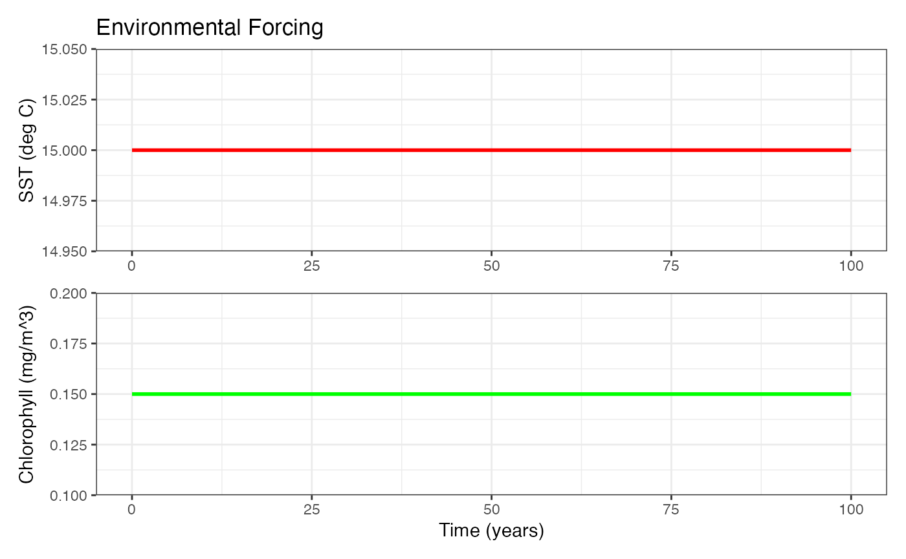
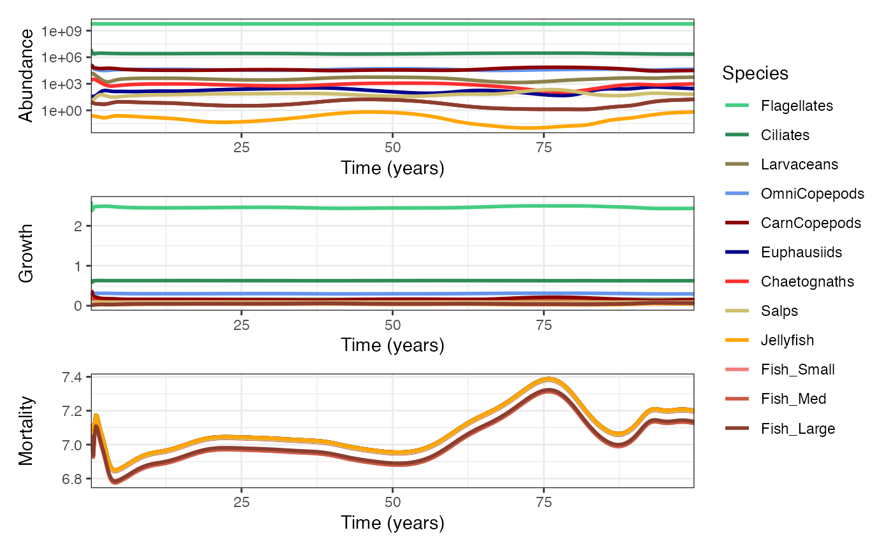
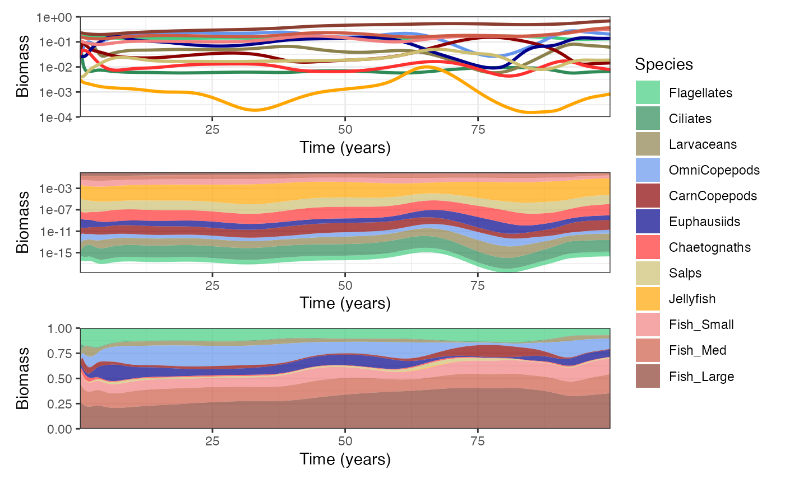
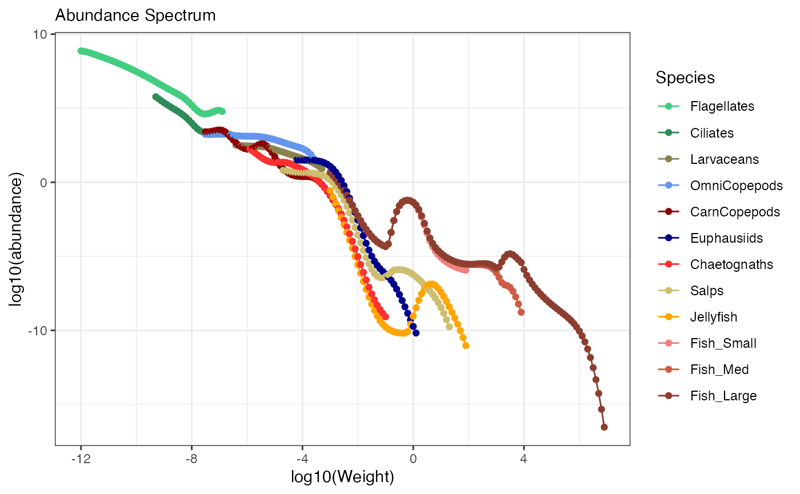
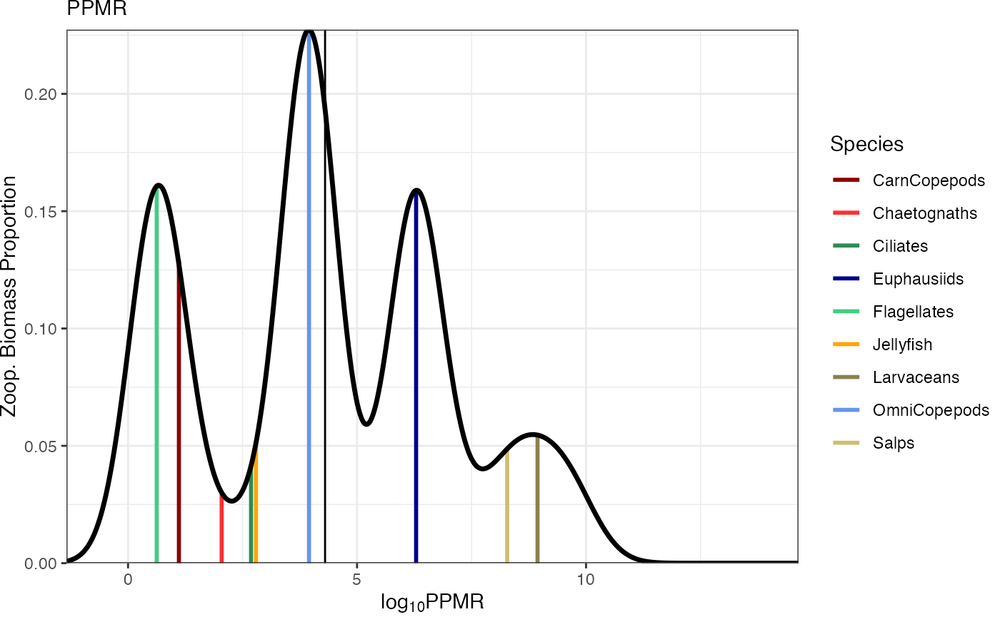

# Getting started with ZooMSS

``` r

library(zoomss)
library(ggplot2)
```

## Input Data

ZooMSS requires two sets of input data:

1.  **Groups** - Contains all taxa-specific parameter values for each
    model group, including size ranges and functional group properties.

2.  **Environmental data** - A Time-series dataframe with time series of
    environmental conditions with `time`, `sst`, and `chl` columns.

## Running the default Model

Get the default published `Groups` dataframe using:

``` r

Groups <- getGroups()
#> Using default ZooMSS functional groups. Use getGroups() to customize.
```

Now create an environmental data time-series using the helper function.
This time-series uses a constant sea surface temperature (`sst`) and
chlorophyll *a* (`chl`) with a 0.1 yr-1 timestep (`dt`).

``` r

env_data <- createInputParams(time = seq(0, 100, by = 0.1) ,
                              sst = 15,
                              chl = 0.15)
#> ZooMSS input parameters created:
#> - Time points: 1001 (time values provided)
#> - Time steps: 1000 (intervals to simulate)
#> - Time range: 0 to 100 years
#> - dt = 0.1 years
#> - SST range: 15 to 15 deg C
#> - Chlorophyll range: 0.15 to 0.15 mg/m^3
```

We can look at the environment data and check everything is ok with:

``` r

plotEnvironment(env_data)
```



Now we run ZooMSS and save every `isave` timestep to reduce storage
requirements.

``` r

mdl <- zoomss_model(input_params = env_data, Groups = Groups, isave = 2)
#> Functional groups validation passed
#> Calculating phytoplankton parameters from environmental time series
```

## Plotting

The model includes several built-in plotting functions for analysis and
visualization.

### Time Series Analysis

These plots display total abundance and mean growth/mortality across all
size classes through time.

``` r


library(patchwork)
p1 <- plotTimeSeries(mdl, by = "abundance", transform = "log10") # Plot abundance time series
p2 <- plotTimeSeries(mdl, by = "growth") # Plot growth rate time series
p3 <- plotTimeSeries(mdl, by = "mortality") # Plot predation mortality time series

wrap_plots(p1, p2, p3, nrow = 3, guides = "collect")
```



We can also plot total biomass through time.

``` r

p4 <- plotTimeSeries(mdl, by = "biomass", transform = "log10") + theme(legend.position = "none") # Plot biomass 
p5 <- plotTimeSeries(mdl, by = "biomass", type = "stack", transform = "log10") # Plot stacked biomass 
p6 <- plotTimeSeries(mdl, by = "biomass", type = "fill") # Plot proportional stacked biomass 

wrap_plots(p4, p5, p6, nrow = 3, guides = "collect")
```



### Static Plots for a given model time point

Plot mean species-resolved size spectra for the final `n_years`.

``` r

plotSizeSpectra(mdl, n_years = 10)
#> Averaging final 10 years (50 saved time steps with isave = 2) of abundance from 500 total saved time steps.
```



Plot predator-prey mass ratios for the `idx` timestep

``` r

plotPPMR(mdl, idx = 500) # Plot final timestep
```


